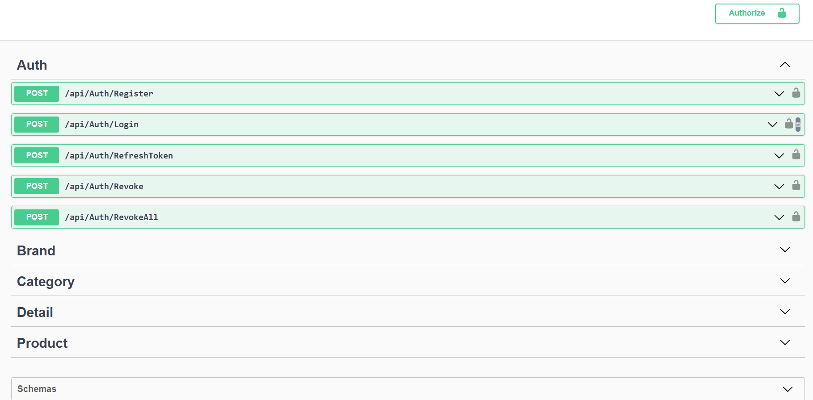
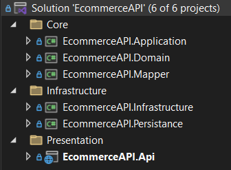
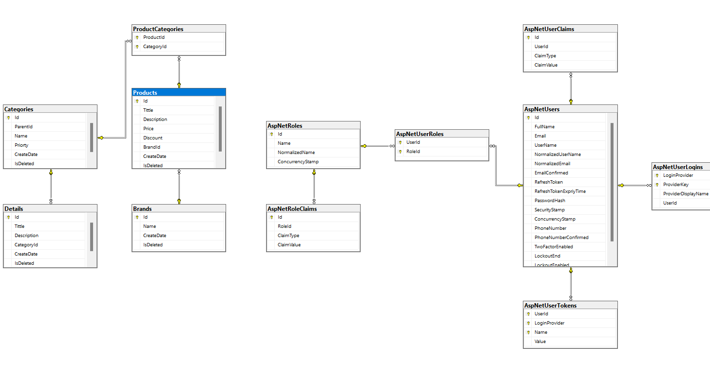

# Ecommerce API
## Project Description
Welcome to the **Ecommerce API** project! This project is a robust, scalable, and maintainable solution designed for managing ecommerce platforms. It utilizes clean architecture, follows SOLID principles, and implements advanced design patterns to ensure high performance and modularity.

---
## Table of Contents
- [Project Description](#project-description)
- [🚀 Features](#features)
- [🏗️ Architecture](#architecture)
- [⚙️ Frameworks & Tools](#frameworks--tools)
- [🔑 Authentication Flow](#authentication-flow)
- [📖 Documentation](#documentation)
- [💡 Advantages of the Architecture](#advantages-of-the-architecture)
- [🧪 Testing](#testing)
- [📥 Getting Started](#getting-started)
- [🖼️ Screenshots & Visuals](#screenshots--visuals)
- [SOLID Principles](#solid-principles)
- [Design Patterns](#design-patterns)
- [Setup and Installation](#setup-and-installation)
- [API Usage](#api-usage)
- [Contributing](#contributing)

---


## 🚀 Features

- **Authentication & Authorization**
  - Supports login, registration, token refresh, and revocation.
  - JWT-based authentication with refresh tokens for secure and efficient access management.
- **Product Management**
  - CRUD operations for products, categories, brands, and details.
- **Redis Integration**
  - Caching for enhanced performance and reduced database load.
- **AutoMapper Integration**
  - Custom mappings for seamless data transformations.
- **MediatR Implementation**
  - Simplifies CQRS pattern implementation.
- **Unit of Work**
  - Ensures transactional consistency and efficient database access.
- **Exception Handling**
  - Centralized and structured handling of application-level exceptions.

---

## 🏗️ Architecture

This project follows **Clean Architecture**, separating concerns into layers:

1. **Core**: Business logic and domain entities.
   - `EcommerceAPI.Application`
   - `EcommerceAPI.Domain`
   - `EcommerceAPI.Mapper`
2. **Infrastructure**: External dependencies and services.
   - Redis caching
   - Token services
3. **Persistence**: Database configurations and repositories.
   - `EcommerceAPI.Persistance`
4. **Presentation**: API layer for external interaction.
   - `EcommerceAPI.Api`

### 🛠 Design Patterns

- **Repository Pattern**: Abstracts data layer for better testability and maintainability.
- **Unit of Work**: Ensures atomicity in transactions across multiple repositories.
- **CQRS (Command Query Responsibility Segregation)**: Separates read and write operations using MediatR.
- **Singleton Pattern**: Applied to Redis connection management for optimal resource utilization.

### 📜 SOLID Principles

- **S**: Single Responsibility - Controllers and services handle specific roles only.
- **O**: Open/Closed - Application layers can extend functionality without modifying existing code.
- **L**: Liskov Substitution - Interface segregation ensures substitutability.
- **I**: Interface Segregation - Granular interfaces for each service/repository.
- **D**: Dependency Inversion - Dependency Injection is used throughout the application.

---

## ⚙️ Frameworks & Tools

- **.NET 7.0**: The foundation of the application.
- **Entity Framework Core**: ORM for database operations.
- **MediatR**: CQRS implementation.
- **Redis**: Caching for improved performance.
- **AutoMapper**: Simplified object mapping.
- **JWT Authentication**: Secure token-based authentication.

---

## 🔑 Authentication Flow

1. **Access Token**: Used for quick authentication.
2. **Refresh Token**: Generates new access tokens upon expiration.

The refresh flow ensures security by invalidating old tokens during user logout.

---

## 🖼️ Screenshots & Visuals

1. **API Endpoints Documentation**  
   

2. **Architecture Overview**  
   

3. **Database Diagram**  
   

---

## 🧪 Testing

- **Unit Tests**: For business logic validation.
- **Integration Tests**: Ensures end-to-end functionality of APIs.
- **Load Tests**: Validates performance under high traffic.

---

## 💡 Advantages of the Architecture

- **Scalability**: Modular design allows independent scaling of components.
- **Maintainability**: Clear separation of concerns makes it easy to extend or refactor.
- **Performance**: Redis caching and efficient database operations ensure fast responses.

---

## 📚 Documentation

- [Swagger API Documentation](https://swagger.io/solutions/api-documentation/)
- [Redis Caching Guide](https://redis.io/docs/getting-started/)

---

## 📥 Getting Started

### Prerequisites

- **.NET SDK 7.0**
- **Redis** installed and running on `localhost:6379`.
- **SQL Server** as the database.

### Installation

1. Clone the repository:  
   ```bash
   git clone https://github.com/your-repo/ecommerce-api.git


# E-Commerce API Projesi

## Proje Açıklaması
E-Commerce API, ürün yönetimi, kullanıcı kimlik doğrulaması ve alışveriş sepeti gibi temel e-ticaret işlevlerini destekleyen bir backend uygulamasıdır. Bu proje, modern yazılım geliştirme ilkelerine uygun olarak geliştirilmiştir ve güçlü bir mimari altyapıya sahiptir.

---

## İçindekiler
- [Proje Açıklaması](#proje-açıklaması)
- [Özellikler](#özellikler)
- [Kullanılan Teknolojiler ve Araçlar](#kullanılan-teknolojiler-ve-araçlar)
- [Mimari Tasarım](#mimari-tasarım)
- [SOLID İlkeleri](#solid-ilkeleri)
- [Tasarım Desenleri](#tasarım-desenleri)
- [Kurulum ve Çalıştırma](#kurulum-ve-çalıştırma)
- [API Kullanımı](#api-kullanımı)
- [Ekran Görüntüleri](#ekran-görüntüleri)
- [Katkıda Bulunma](#katkıda-bulunma)

---

## Özellikler
- Kullanıcı kimlik doğrulama ve yetkilendirme (JWT ve Refresh Token desteği).
- Ürün, kategori, marka ve detay yönetimi için CRUD operasyonları.
- Redis ile hızlı önbellekleme.
- Unit of Work ve Repository desenleri ile veri erişim yönetimi.
- Mediatr ile CQRS uygulaması.
- AutoMapper ile DTO ve Entity dönüşümleri.

---

## Kullanılan Teknolojiler ve Araçlar

| Teknoloji/Çerçeve     | Açıklama                                     |
|-----------------------|---------------------------------------------|
| **.NET 7.0**         | Projenin temel backend framework'ü.        |
| **Entity Framework Core** | Veri tabanı işlemleri için ORM aracı.      |
| **Redis**             | Veri önbellekleme çözümü.                  |
| **AutoMapper**        | DTO ve entity dönüşümleri için araç.       |
| **Mediatr**           | CQRS desenini uygulamak için kütüphane.    |
| **Fluent Validation** | Doğrulama işlemleri için kullanılan araç.  |

---

## Mimari Tasarım
Bu proje, temiz mimari prensiplerini takip eder. Katmanlar şu şekilde organize edilmiştir:

### Katmanlar
- **Core**: Uygulamanın temel iş mantığı.
  - DTOs, Validations, Interfaces, Base Classes.
- **Infrastructure**: Altyapı servisleri.
  - Redis, Repository Implementations.
- **Presentation**: API katmanı.
  - Controllers, Exception Handlers.

### SOLID İlkeleri
- **S**ingle Responsibility Principle: Her sınıf tek bir sorumluluğa sahiptir.
- **O**pen/Closed Principle: Yeni özellikler eklerken mevcut kodlar değiştirilmez.
- **L**iskov Substitution Principle: Türetilmiş sınıflar, taban sınıflarının yerini alabilir.
- **I**nterface Segregation Principle: Gereksiz metodlar içermeyen arayüzler.
- **D**ependency Inversion Principle: Bağımlılıklar soyutlamalar üzerinden yönetilir.

### Uygulanan Tasarım Desenleri
- **Generic Repository Pattern**: Veri erişim katmanı.
- **Unit of Work**: Veri tabanı işlemleri için tek bir transaction yönetimi.
- **CQRS**: Sorgu ve komut işlemlerinin ayrılması.
- **Factory**: Nesne oluşturma yönetimi.
- **Decorator**: Davranışların katmanlı eklenmesi.

---

## Kurulum ve Çalıştırma
### Gereksinimler
- .NET 7.0 SDK
- Redis Server
- MSSQL Server

### Adımlar
1. **Repository'yi Klonlayın**
```bash
git clone https://github.com/kullaniciadi/EcommerceAPI.git
```
2. **Bağımlılıkları Yükleyin**
```bash
cd EcommerceAPI
```
```bash
dotnet restore
```
3. **Veritabanını Migrasyonlarla Güncelleyin**
```bash
dotnet ef database update
```
4. **Proje Çalıştırma**
```bash
dotnet run --project Presentation/EcommerceAPI.Api
```

---

## API Kullanımı
### Kimlik Doğrulama Örnekleri
#### 1. Kullanıcı Girişi (Login)
```http
POST /api/Auth/Login
```
```json
{
  "email": "string@gmail.com",
  "password": "string123"
}
```
#### 2. Refresh Token Alımı
```http
POST /api/Auth/RefreshToken
```

---

## Ekran Görüntüleri
- **Swagger Kullanıcı Arayüzü**:
   
- **Veritabanı Yapısı**:
   

---

## Katkıda Bulunma
Katkıda bulunmak isterseniz:
1. Bir fork oluşturun.
2. Yeni bir dal (branch) oluşturun.
```bash
git checkout -b feature/yenilik
```
3. Değişikliklerinizi yapın ve commit edin.
4. Bir Pull Request oluşturun.

---
📞 Contact
Email: arifabdulla034@gmail.com
GitHub: [GitHubProfile](https://github.com/AbdullaArif/)
